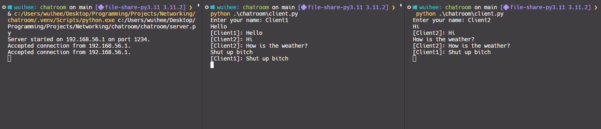

# Python Network Programming Project: Chatroom

## Objective

Learn basic network programming by creating a chatroom hosted on localhost where multiple clients can send messages for everyone to see.

## Running the Server and Client

To start the chatroom, first run the server:

```bash
python ./chatroom/server.py
```

Next, run as many clients as you'd like:

```bash
python ./chatroom/client.py
```

Each client should ask for a username. After that simply send messages into the terminal.


